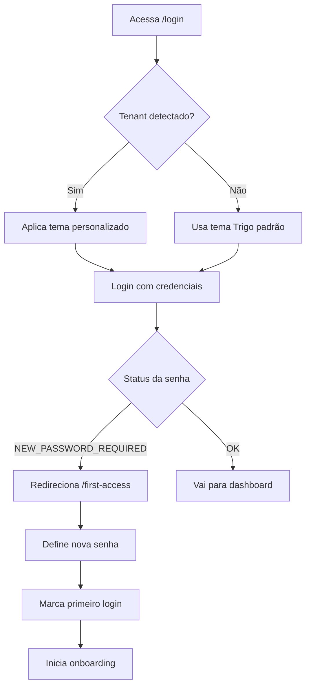
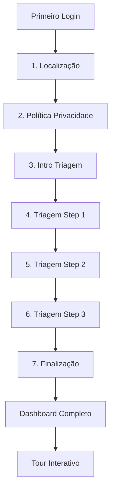
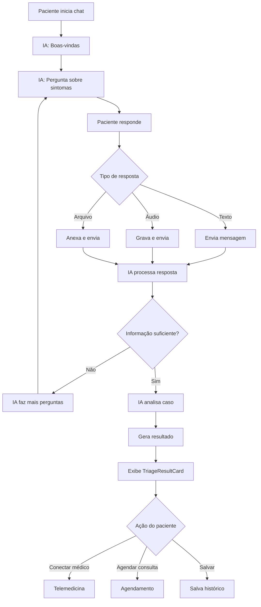
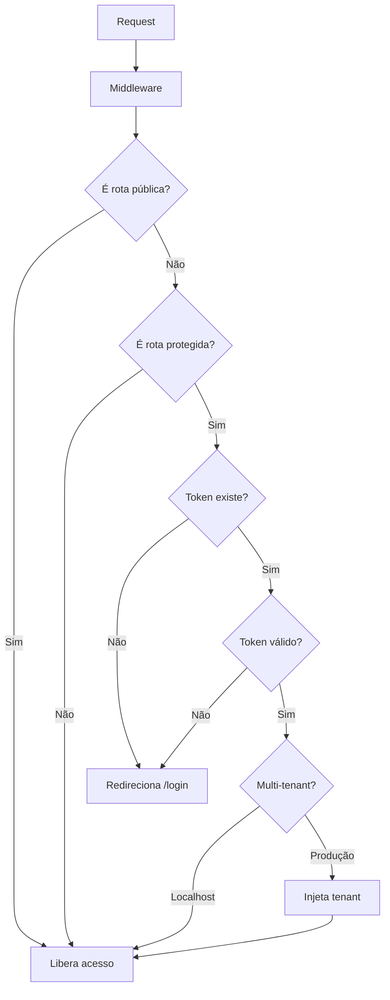
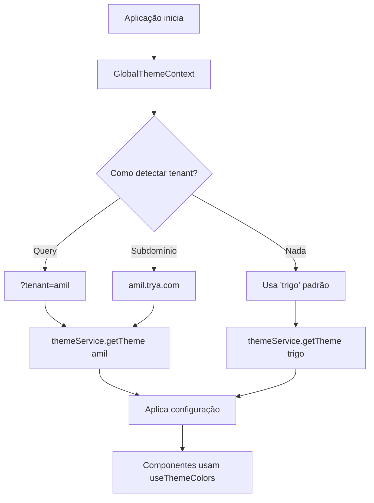

# 🏥 Trya Frontend - Visão Geral Completa do Sistema

> Documentação técnica completa do sistema de saúde inteligente com IA

**Última atualização:** 20 de Novembro de 2025  
**Versão:** 1.0.0

---

## 📋 Índice

1. [Visão Geral](#-visão-geral)
2. [Principais Funcionalidades](#-principais-funcionalidades)
3. [Perfis de Usuário](#-perfis-de-usuário)
4. [Fluxos Completos](#-fluxos-completos)
5. [Arquitetura Técnica](#️-arquitetura-técnica)
6. [Integrações e APIs](#-integrações-e-apis)
7. [Gerenciamento de Estado](#-gerenciamento-de-estado)
8. [Sistema de Design](#-sistema-de-design)
9. [Segurança](#-segurança)
10. [Exemplo de Uso Completo](#-exemplo-de-uso-completo)

---

## 🎯 Visão Geral

O **Trya Frontend** é uma plataforma moderna de saúde digital que integra **inteligência artificial**, **telemedicina** e **gestão de beneficiários de saúde**. O sistema é **multi-tenant** (suporta múltiplos clientes/empresas), desenvolvido com **Next.js 15**, **React 19**, **TypeScript** e **Material-UI**.

### Características Principais

- ✅ **Multi-tenant** - Suporta múltiplos clientes com temas personalizados
- ✅ **IA Integrada** - Triagem médica automatizada
- ✅ **Responsivo** - Funciona perfeitamente em mobile, tablet e desktop
- ✅ **Seguro** - Autenticação JWT, middleware de proteção
- ✅ **Escalável** - Arquitetura modular e componentizada
- ✅ **Acessível** - Seguindo padrões WCAG

---

## 🚀 Principais Funcionalidades

### 1. Triagem Inteligente com IA

Sistema de chat interativo que utiliza inteligência artificial para fazer triagem médica automatizada.

**Recursos:**
- 💬 Chat em tempo real com IA
- 🎤 Suporte a mensagens de áudio
- 📎 Anexo de imagens e documentos
- 📊 Análise de sintomas e recomendações
- 📝 Histórico completo de triagens

**Localização:** `/paciente/triagem`

---

### 2. Gestão de Beneficiários (Admin RH)

Sistema completo para administradores RH gerenciarem beneficiários de planos de saúde.

**Recursos:**
- 👥 Cadastro e edição de beneficiários
- 🏥 Integração com operadoras e planos
- 🔄 Sincronização de dados
- 🎨 Personalização visual do sistema
- 📋 Listagem paginada e filtros

**Localização:** `/admin-rh/beneficiarios`

---

### 3. Dashboard do Paciente

Painel completo para o paciente visualizar seus dados de saúde e acessar serviços.

**Recursos:**
- 📇 Visualização de dados do plano
- 💊 Histórico médico (condições, medicamentos, alergias)
- 📄 Histórico clínico completo
- 🔗 Acesso rápido a serviços
- 🎓 Tour interativo para novos usuários

**Localização:** `/paciente`

---

### 4. Sistema Multi-Tenant

Suporte completo a múltiplos clientes com personalização total.

**Recursos:**
- 🎨 Cores personalizadas por cliente
- 🖼️ Logos e backgrounds customizados
- 🔤 Fontes personalizadas
- 🌐 Subdomínios ou query parameters
- 🏢 Tenant padrão: **Trigo**

**Como usar:**
```
Sem parâmetro: trya.com → Trigo (padrão)
Query param: trya.com?tenant=amil → Amil
Subdomínio: amil.trya.com → Amil
```

---

### 5. Autenticação e Segurança

Sistema robusto de autenticação com JWT e proteção de rotas.

**Recursos:**
- 🔐 Login com email/senha
- 🔄 Refresh tokens automático
- 🆕 Fluxo de primeiro acesso
- 🔑 Recuperação de senha completa
- 🛡️ Middleware de proteção
- 🚪 Redirecionamento por perfil (role)

---

## 👥 Perfis de Usuário (Roles)

O sistema suporta diferentes perfis, cada um com seu próprio dashboard:

| Role | Rota | Descrição |
|------|------|-----------|
| **Paciente** | `/paciente` | Usuário final do plano de saúde |
| **Admin RH** | `/admin-rh` | Gestor de beneficiários da empresa |
| **Médico** | `/medico` | Profissional de saúde (em desenvolvimento) |
| **Admin** | `/admin` | Administrador do sistema |
| **Super Admin** | `/super-admin` | Super administrador |
| **Cliente** | `/cliente` | Gestor do cliente/empresa |

**Redirecionamento Automático:** Após login, o sistema redireciona automaticamente para o dashboard correto baseado no role do usuário.

---

## 🔄 Fluxos Completos

### 📍 FLUXO 1: Acesso e Autenticação

#### 1.1 Primeiro Acesso



**Passos detalhados:**

1. Usuário acessa `/login` (ou `/login?tenant=cliente`)
2. Sistema detecta o tenant (por URL ou subdomínio)
3. Aplica tema personalizado (cores, logo, fonte)
4. Usuário faz login com email/senha
5. Backend retorna JWT + status `NEW_PASSWORD_REQUIRED`
6. Sistema redireciona para `/first-access`
7. Usuário define nova senha
8. Sistema marca como "primeiro login" (`localStorage`)
9. Redireciona para dashboard do seu role
10. Inicia processo de onboarding

#### 1.2 Login Normal

**Fluxo:**
```
/login → Credenciais → Valida → JWT → Cookie → Dashboard
```

1. Usuário acessa `/login`
2. Insere credenciais (email + senha)
3. Backend valida e retorna JWT
4. Sistema salva token em cookies HTTP-only
5. Redireciona para dashboard baseado no role

#### 1.3 Recuperação de Senha

**Fluxo:**
```
/password-reset → Email → /verify → Código → /new-password → Login
```

1. Usuário acessa `/password-reset`
2. Insere email
3. Backend envia código de verificação
4. Usuário acessa `/password-reset/verify`
5. Insere código recebido
6. Backend valida código
7. Redireciona para `/password-reset/new-password`
8. Define nova senha
9. Retorna ao login

---

### 📍 FLUXO 2: Onboarding do Paciente

Quando um paciente faz login pela primeira vez, ele passa por um processo de onboarding completo e sequencial.



#### Sequência Detalhada:

##### 1️⃣ Compartilhamento de Localização
**Rota:** `/paciente/onboarding/location`

- Solicita permissão de localização do browser
- Explica porque a localização é necessária
- Salva flag: `paciente_location_onboarding_completed`
- **Next:** Política de Privacidade

##### 2️⃣ Aceite de Política de Privacidade
**Rota:** `/paciente/onboarding/privacy-acceptance`

- Exibe política de privacidade completa
- Usuário deve aceitar termos
- Salva flag: `paciente_privacy_acceptance_completed`
- **Next:** Introdução à Triagem

##### 3️⃣ Introdução à Triagem
**Rota:** `/paciente/onboarding/triagem-intro`

- Explica como funciona a triagem com IA
- Apresenta benefícios do sistema
- Prepara usuário para coleta de dados
- Salva flag: `paciente_triagem_intro_completed`
- **Next:** Triagem Step 1

##### 4️⃣ Triagem Step 1
**Rota:** `/paciente/onboarding/triagem/step1`

- Coleta dados iniciais de saúde
- Perguntas básicas sobre condições
- Salva flag: `paciente_triagem_step1_completed`
- **Next:** Triagem Step 2

##### 5️⃣ Triagem Step 2
**Rota:** `/paciente/onboarding/triagem/step2`

- Coleta informações sobre medicamentos
- Alergias e reações
- Salva flag: `paciente_triagem_step2_completed`
- **Next:** Triagem Step 3

##### 6️⃣ Triagem Step 3
**Rota:** `/paciente/onboarding/triagem/step3`

- Finaliza coleta de dados
- Histórico familiar
- Salva flag: `paciente_triagem_step3_completed`
- **Next:** Finalização

##### 7️⃣ Finalização
**Rota:** `/paciente/onboarding/triagem/final`

- Mostra resumo e conclusão
- Parabeniza pela conclusão
- Salva flag: `paciente_triagem_final_completed`
- Remove flag: `user_is_first_login`
- **Next:** Dashboard

##### 8️⃣ Dashboard com Tour
**Rota:** `/paciente`

- Acesso completo ao sistema
- Tour interativo inicia automaticamente
- Apresenta cada seção do dashboard

#### Validação e Controle

O sistema verifica as flags em **ordem sequencial** no `useEffect`:

```typescript
// Em src/app/(authenticated)/paciente/page.tsx

1. Verifica se é primeiro login
   ↓ Se NÃO → Dashboard normal
   ↓ Se SIM → Continua verificação

2. Verifica location_onboarding_completed
   ↓ Se NÃO → /onboarding/location
   ↓ Se SIM → Próximo

3. Verifica privacy_acceptance_completed
   ↓ Se NÃO → /onboarding/privacy-acceptance
   ↓ Se SIM → Próximo

4. Verifica triagem_intro_completed
   ↓ Se NÃO → /onboarding/triagem-intro
   ↓ Se SIM → Próximo

5. Verifica triagem_final_completed
   ↓ Se NÃO → Verifica steps e vai pro incompleto
   ↓ Se SIM → Dashboard completo
```

**Importante:** Se o usuário tentar acessar o dashboard diretamente, o sistema **sempre redireciona** para a etapa pendente.

---

### 📍 FLUXO 3: Dashboard do Paciente

Após completar o onboarding (ou em logins subsequentes), o paciente acessa o dashboard completo.

#### Layout do Dashboard

```
┌─────────────────────────────────────────────────────────────┐
│  NAVBAR (Topo)                                              │
├─────────────────┬───────────────────────────────────────────┤
│                 │                                           │
│  [SIDEBAR]      │  [ÁREA PRINCIPAL]                        │
│  (320px)        │  (Flex 1)                                │
│                 │                                           │
│  ┌───────────┐  │  ┌─────────────────────────────────────┐ │
│  │ Paciente  │  │  │ Banner Boas-vindas                  │ │
│  │ Card      │  │  │ "Olá, [Nome]!"                      │ │
│  │           │  │  └─────────────────────────────────────┘ │
│  │ • Nome    │  │                                           │
│  │ • Plano   │  │  [GRID DE SERVIÇOS - 3 colunas]          │
│  │ • Operad. │  │                                           │
│  │ • Validade│  │  ┌──────┐  ┌──────┐  ┌──────┐           │
│  └───────────┘  │  │Triagem│  │ Rede │  │Exames│           │
│                 │  │  IA  │  │Crede.│  │      │           │
│  ┌───────────┐  │  └──────┘  └──────┘  └──────┘           │
│  │ Histórico │  │                                           │
│  │  Médico   │  │  ┌──────┐  ┌──────┐  ┌──────┐           │
│  │           │  │  │Teleme│  │Agenda│  │ Docs │           │
│  │• Condições│  │  │dicina│  │      │  │      │           │
│  │• Medicam. │  │  └──────┘  └──────┘  └──────┘           │
│  │• Alergias │  │                                           │
│  └───────────┘  │                                           │
│                 │                                           │
│  ┌───────────┐  │                                           │
│  │ Histórico │  │                                           │
│  │  Clínico  │  │                                           │
│  │           │  │                                           │
│  │• Consultas│  │                                           │
│  │• Procedim.│  │                                           │
│  └───────────┘  │                                           │
│                 │                                           │
└─────────────────┴───────────────────────────────────────────┘
```

#### Componentes do Dashboard

**Sidebar (Esquerda):**
- `PatientCard` - Dados do plano de saúde
- `PatientHistoryCard` - Histórico médico
- `ClinicalHistoryCard` - Histórico clínico

**Área Principal (Direita):**
- `WelcomeSection` - Banner de boas-vindas
- `ServicesGrid` - Grid de serviços disponíveis

#### Serviços Disponíveis

1. **Triagem Inteligente** - Chat com IA para triagem
2. **Rede Credenciada** - Buscar médicos e hospitais
3. **Resultados de Exames** - Visualizar e baixar exames
4. **Telemedicina** - Consultas por vídeo
5. **Agendar Consulta** - Marcar consultas
6. **Meus Documentos** - Gerenciar documentos de saúde

#### Carregamento de Dados

```typescript
// API: /api/auth/me
{
  id: "123",
  name: "Maria Silva",
  email: "maria@email.com",
  role: "paciente",
  healthPlan: {
    name: "Plano Gold",
    operator: "Amil",
    cardNumber: "1234567890",
    validity: "2025-12-31"
  },
  medicalHistory: {
    conditions: ["Hipertensão"],
    medications: ["Losartana 50mg"],
    allergies: ["Penicilina"]
  }
}
```

#### Tour Interativo (Primeira Vez)

Usa `react-joyride` para guiar o usuário:

```javascript
Steps do Tour:
1. "Bem-vindo! Este é seu dashboard"
2. "Aqui estão seus dados do plano"
3. "Histórico médico e medicamentos"
4. "Serviços disponíveis para você"
5. "Clique em Triagem para começar"
```

---

### 📍 FLUXO 4: Triagem Inteligente com IA

Sistema de chat interativo com IA para triagem médica.

#### Layout da Triagem

```
┌─────────────────────────────────────────────────────────────┐
│  CHAT HEADER                                                │
│  "Triagem Inteligente" | [Minimizar] [Fechar]             │
├─────────────────┬───────────────────────────────────────────┤
│                 │                                           │
│  [SIDEBAR]      │  [ÁREA DE CHAT]                          │
│  (280px)        │                                           │
│                 │  ┌─────────────────────────────────────┐ │
│  • Dados        │  │ [Mensagens anteriores...]           │ │
│    Paciente     │  │                                     │ │
│                 │  │ IA: Olá! O que você está sentindo? │ │
│  • Etapas       │  │                                     │ │
│    ○ Sintomas   │  │ [Você]: Dor de cabeça forte        │ │
│    ○ Análise    │  │                                     │ │
│    ○ Resultado  │  │ IA: Há quanto tempo?               │ │
│                 │  │                                     │ │
│  • Dados de     │  │ [Você]: 🎤 [Áudio: 5s]             │ │
│    Saúde        │  │                                     │ │
│    - PA: 120/80 │  │ IA: Tem febre?                     │ │
│    - Temp: 36.5°│  │                                     │ │
│                 │  │ [Você]: Não                        │ │
│  • Validação    │  │                                     │ │
│    Médica       │  │ IA: [Analisando...]                │ │
│    Pendente     │  │                                     │ │
│                 │  └─────────────────────────────────────┘ │
│  • Histórico    │                                           │
│    - 15/11/2025 │  [INPUT]                                  │
│    - 10/11/2025 │  ┌─────────────────────────────────────┐ │
│                 │  │ Digite sua mensagem...              │ │
│                 │  │ [📎] [🎤] [Enviar]                  │ │
│                 │  └─────────────────────────────────────┘ │
└─────────────────┴───────────────────────────────────────────┘
```

#### Componentes do Chat

**Chat Principal:**
- `ChatHeader` - Cabeçalho com título e ações
- `ChatMessage` - Mensagens de texto (usuário e IA)
- `AudioMessage` - Mensagens de áudio reproduzíveis
- `FileAttachment` - Visualização de anexos
- `TriageResultCard` - Card com resultado final
- `ChatInput` - Input multimodal (texto/áudio/arquivo)

**Sidebar:**
- `PatientCard` - Dados do paciente
- `Steps` - Etapas da triagem
- `HealthDataCards` - Dados vitais
- `ValidationCard` - Status da validação médica
- `HistoryList` - Histórico de triagens

#### Fluxo da Conversa



#### Exemplo de Conversa Real

```
👤 Paciente: [Inicia conversa]

🤖 IA: Olá! Sou a assistente virtual Trya. Vou fazer algumas 
       perguntas para entender melhor o que você está sentindo. 
       O que trouxe você aqui hoje?

👤 Paciente: Estou com dor de cabeça forte

🤖 IA: Entendo. Há quanto tempo você está com essa dor de cabeça?

👤 Paciente: [Áudio 🎤] "Desde ontem à noite, mais ou menos 
       umas 20 horas"

🤖 IA: Você tem febre ou algum outro sintoma além da dor?

👤 Paciente: Não, só a dor mesmo

🤖 IA: A dor é:
       1. Latejante (pulsante)
       2. Constante (pressão)
       3. Em pontadas

👤 Paciente: 1

🤖 IA: Você tem sensibilidade à luz ou sons?

👤 Paciente: Sim, luz me incomoda

🤖 IA: Já teve episódios parecidos antes?

👤 Paciente: Sim, algumas vezes

🤖 IA: [Analisando suas respostas...]

━━━━━━━━━━━━━━━━━━━━━━━━━━━━━━━━━━━━━━━━
📋 RESULTADO DA TRIAGEM
━━━━━━━━━━━━━━━━━━━━━━━━━━━━━━━━━━━━━━━━

⚠️ Gravidade: MÉDIA

🩺 Possível diagnóstico:
   Enxaqueca (Migrânea)

💡 Recomendações:
   • Consulta com neurologista
   • Ambiente escuro e silencioso
   • Hidratação adequada
   • Analgésico (se prescrito)

📅 Ações sugeridas:
   [Conectar com médico agora]
   [Agendar consulta]
   [Ir para emergência - se piorar]

━━━━━━━━━━━━━━━━━━━━━━━━━━━━━━━━━━━━━━━━
```

#### Tipos de Gravidade

- 🟢 **BAIXA** - Autocuidado e monitoramento
- 🟡 **MÉDIA** - Consulta recomendada
- 🟠 **ALTA** - Consulta urgente
- 🔴 **CRÍTICA** - Emergência imediata

#### Integração com Backend

**Service:** `chatService.ts`

```typescript
// Enviar mensagem
POST /api/chat/send
{
  message: "Estou com dor de cabeça",
  triageId: "uuid",
  type: "text"
}

// Enviar áudio
POST /api/chat/audio
FormData {
  audio: Blob,
  triageId: "uuid"
}

// Histórico
GET /api/chat/history/:triageId
```

**Hook:** `useChat()`

```typescript
const {
  messages,        // Array de mensagens
  sendMessage,     // Função para enviar texto
  sendAudio,       // Função para enviar áudio
  sendFile,        // Função para enviar arquivo
  isLoading,       // Estado de loading
  triageResult     // Resultado final (se houver)
} = useChat();
```

---

### 📍 FLUXO 5: Admin RH - Gestão de Beneficiários

Sistema completo para administradores RH gerenciarem beneficiários.

#### Estrutura de Navegação

```
/admin-rh (Home)
    ↓
    [Card: Beneficiários] → /admin-rh/beneficiarios (Lista)
                                ↓
                                [+ Adicionar] → /admin-rh/beneficiarios/novo
                                [Editar] → /admin-rh/beneficiarios/[id]
                                [Visualizar] → /admin-rh/beneficiarios/[id]
                                [Excluir] → Modal de confirmação
```

#### Tela 1: Dashboard Admin RH

```
┌─────────────────────────────────────────────────────────────┐
│  [HERO BANNER]                                              │
│  Imagem grande com ilustração                               │
│  "Bem-vindo ao painel administrativo"                       │
└─────────────────────────────────────────────────────────────┘

┌─────────────────────┐  ┌─────────────────────┐
│  [CARD 1]           │  │  [CARD 2]           │
│  👥 Beneficiários   │  │  🎨 Personalização  │
│                     │  │                     │
│  Visualize,         │  │  Gerencie cores,    │
│  cadastre ou edite  │  │  fundos e elementos │
│                     │  │  visuais            │
│  [Acessar →]        │  │  [Acessar →]        │
└─────────────────────┘  └─────────────────────┘
```

#### Tela 2: Lista de Beneficiários

```
┌─────────────────────────────────────────────────────────────┐
│  Beneficiários                          [+ Adicionar]       │
├─────────────────────────────────────────────────────────────┤
│  [🔍 Buscar...] [Filtro: Todos ▼] [Operadora: Todas ▼]    │
├─────────────────────────────────────────────────────────────┤
│                                                             │
│  ┌─────────────────────────────────────────────────────┐   │
│  │ Maria Silva            Plano Gold - Amil    [•••]   │   │
│  │ maria@email.com        Ativo                        │   │
│  └─────────────────────────────────────────────────────┘   │
│                                                             │
│  ┌─────────────────────────────────────────────────────┐   │
│  │ João Santos            Plano Silver - Bradesco [•••]│   │
│  │ joao@email.com         Ativo                        │   │
│  └─────────────────────────────────────────────────────┘   │
│                                                             │
│  ┌─────────────────────────────────────────────────────┐   │
│  │ Ana Costa              Plano Basic - Unimed    [•••]│   │
│  │ ana@email.com          Inativo                      │   │
│  └─────────────────────────────────────────────────────┘   │
│                                                             │
│  [◄ Anterior]  Página 1 de 5  [Próxima ►]                 │
└─────────────────────────────────────────────────────────────┘
```

**Ações no Menu (•••):**
- 👁️ Visualizar
- ✏️ Editar
- 🗑️ Excluir
- 🔄 Sincronizar

#### Tela 3: Formulário de Cadastro

```
┌─────────────────────────────────────────────────────────────┐
│  ← Voltar | Novo Beneficiário                               │
├─────────────────────────────────────────────────────────────┤
│                                                             │
│  DADOS PESSOAIS                                             │
│  ┌─────────────────────────────────────────────────────┐   │
│  │ Nome Completo *                                     │   │
│  │ [________________________]                          │   │
│  └─────────────────────────────────────────────────────┘   │
│                                                             │
│  ┌─────────────────────┐  ┌──────────────────────────┐    │
│  │ CPF *               │  │ Data de Nascimento *     │    │
│  │ [___.___.___-__]    │  │ [__/__/____]             │    │
│  └─────────────────────┘  └──────────────────────────┘    │
│                                                             │
│  CONTATO                                                    │
│  ┌─────────────────────────────────────────────────────┐   │
│  │ Email *                                             │   │
│  │ [________________________]                          │   │
│  └─────────────────────────────────────────────────────┘   │
│                                                             │
│  ┌─────────────────────┐  ┌──────────────────────────┐    │
│  │ Telefone            │  │ Celular *                │    │
│  │ [(__) ____-____]    │  │ [(__) _____-____]        │    │
│  └─────────────────────┘  └──────────────────────────┘    │
│                                                             │
│  PLANO DE SAÚDE                                             │
│  ┌─────────────────────────────────────────────────────┐   │
│  │ Operadora *                                         │   │
│  │ [Selecione... ▼]                                    │   │
│  └─────────────────────────────────────────────────────┘   │
│                                                             │
│  ┌─────────────────────┐  ┌──────────────────────────┐    │
│  │ Plano *             │  │ Número da Carteirinha    │    │
│  │ [Selecione... ▼]    │  │ [__________________]     │    │
│  └─────────────────────┘  └──────────────────────────┘    │
│                                                             │
│  ┌─────────────────────┐                                   │
│  │ Validade            │                                   │
│  │ [__/__/____]        │                                   │
│  └─────────────────────┘                                   │
│                                                             │
│  DEPENDENTES                                                │
│  □ Este beneficiário possui dependentes                    │
│                                                             │
│  [Cancelar]                             [Salvar]           │
└─────────────────────────────────────────────────────────────┘
```

#### Validações do Formulário

```typescript
// Validações em tempo real
- Nome: Mínimo 3 caracteres
- CPF: Formato válido (11 dígitos)
- Email: Formato válido (regex)
- Data Nascimento: Maior de 18 anos (titular)
- Celular: Formato válido
- Operadora: Obrigatório
- Plano: Obrigatório
```

#### APIs Utilizadas

```typescript
// Listar beneficiários
GET /api/beneficiaries?page=1&limit=10&search=maria&operator=amil

// Criar beneficiário
POST /api/beneficiaries
Body: {
  name: string,
  cpf: string,
  birthDate: string,
  email: string,
  phone: string,
  mobile: string,
  healthOperatorId: string,
  healthPlanId: string,
  cardNumber: string,
  validity: string,
  dependents: []
}

// Editar beneficiário
PUT /api/beneficiaries/:id
Body: { ... }

// Excluir beneficiário
DELETE /api/beneficiaries/:id

// Operadoras disponíveis
GET /api/health-operators

// Planos de uma operadora
GET /api/health-plans?operatorId=xxx
```

#### Services do Módulo

**Arquivos:**
- `beneficiaryService.ts` - CRUD de beneficiários
- `healthOperatorService.ts` - Operadoras de saúde
- `healthPlanService.ts` - Planos de saúde
- `tenantService.ts` - Dados do tenant/empresa

---

### 📍 FLUXO 6: Middleware e Proteção de Rotas

O middleware (`src/middleware.ts`) executa **antes de cada request** para proteger rotas e gerenciar acesso.

#### Ordem de Execução



#### Lógica Detalhada

```typescript
// src/middleware.ts

export function middleware(req: NextRequest) {
  // 1. Extrai informações da URL
  const pathname = url.pathname;
  const tenant = url.searchParams.get('tenant');
  const role = resolveRoleFromRequest(pathname, searchParams);
  
  // 2. ROTAS PÚBLICAS (não precisam de autenticação)
  const publicRoutes = [
    '/login',
    '/first-access',
    '/password-reset',
    '/password-reset/verify',
    '/password-reset/new-password'
  ];
  
  if (isPublicRoute(pathname)) {
    return NextResponse.next(); // ✅ Libera
  }
  
  // 3. ROTAS PROTEGIDAS (precisam de autenticação)
  const protectedRoutes = [
    '/paciente',
    '/admin-rh',
    '/medico',
    '/admin',
    '/super-admin'
  ];
  
  if (isProtectedRoute(pathname)) {
    const token = req.cookies.get('accessToken')?.value;
    
    // Valida token
    if (!token || token.trim() === '') {
      return redirectToLogin(req, role, tenant); // ❌ Sem token
    }
    
    // Valida formato JWT (3 partes: header.payload.signature)
    const tokenParts = token.split('.');
    if (tokenParts.length !== 3) {
      return redirectToLogin(req, role, tenant); // ❌ Token inválido
    }
  }
  
  // 4. MULTI-TENANT (subdomínio)
  const host = req.headers.get('host'); // ex: amil.trya.com
  const isDevHost = host.includes('localhost');
  
  if (!isDevHost) {
    const subdomain = host.split('.')[0]; // amil
    if (subdomain && subdomain !== 'www') {
      // Injeta tenant na URL
      url.searchParams.set('tenant', subdomain);
      return NextResponse.rewrite(url); // ✅ Com tenant
    }
  }
  
  // 5. Libera acesso
  return NextResponse.next(); // ✅
}
```

#### Redirecionamento para Login

```typescript
function redirectToLogin(req: NextRequest, role: string, tenant?: string) {
  const loginUrl = new URL('/login', req.url);
  
  // Preserva tenant na URL
  if (tenant) {
    loginUrl.searchParams.set('tenant', tenant);
  }
  
  // Remove tokens inválidos
  const response = NextResponse.redirect(loginUrl);
  response.cookies.delete('accessToken');
  response.cookies.delete('refreshToken');
  
  return response;
}
```

#### Exemplo de Fluxo

```
1. Usuário tenta acessar: /paciente/triagem

2. Middleware executa:
   ✓ Rota protegida? Sim
   ✓ Token existe? Sim
   ✓ Token válido? Sim
   ✓ Libera acesso → /paciente/triagem

3. Usuário tenta acessar: /admin-rh (sem login)

4. Middleware executa:
   ✓ Rota protegida? Sim
   ✗ Token existe? Não
   → Redireciona para /login

5. Usuário acessa: amil.trya.com/login

6. Middleware executa:
   ✓ Subdomínio: amil
   ✓ Injeta: ?tenant=amil
   → Reescreve URL: /login?tenant=amil
```

---

### 📍 FLUXO 7: Sistema de Temas Multi-Tenant

Sistema completo para personalização por cliente.

#### Como Funciona



#### Configuração de Tema

```typescript
// src/shared/services/themeService.ts

const themes = {
  'trigo': {
    id: 'trigo',
    name: 'Trigo Franquias',
    subdomain: 'trigo',
    colors: {
      primary: '#DDA741',        // Amarelo mostarda
      secondary: '#F5E6D3',      // Bege claro
      textDark: '#041616',       // Quase preto
      textMuted: '#4A6060',      // Cinza esverdeado
      background: '#F9FAFB',     // Cinza claro
      cardBackground: '#FFFFFF', // Branco
      softBorder: '#E5E7EB',     // Cinza borda
      white: '#FFFFFF',
      success: '#10B981',
      successSoft: '#D1FAE5',
      avatarBackground: '#FEF3C7',
      backgroundSoft: 'rgba(221, 167, 65, 0.1)',
      iconBackground: '#FEF3C7'
    },
    images: {
      logo: '/logo_trigo.png',
      backgroundPattern: '/patterns/trigo_pattern.png' // opcional
    },
    typography: {
      fontFamily: 'Inter, system-ui, -apple-system, sans-serif',
      fontSize: {
        xs: '12px',
        sm: '14px',
        md: '16px',
        lg: '18px',
        xl: '20px',
        '2xl': '24px'
      },
      fontWeight: {
        normal: 400,
        medium: 500,
        semibold: 600,
        bold: 700
      }
    },
    layout: {
      logoPosition: 'center',    // 'left' | 'center' | 'right'
      showPoweredBy: true,
      poweredByText: 'Powered by Trya',
      navbarHeight: '64px',
      sidebarWidth: '320px'
    }
  },
  
  'amil': {
    id: 'amil',
    name: 'Amil Saúde',
    subdomain: 'amil',
    colors: {
      primary: '#0066CC',        // Azul Amil
      secondary: '#E6F2FF',      // Azul claro
      // ... outras cores
    },
    images: {
      logo: '/amil.png'
      // Sem backgroundPattern → Usa padrões decorativos
    },
    // ... resto da configuração
  }
};
```

#### Adicionando Novo Tenant

```typescript
// 1. Adicionar configuração no themeService.ts
'novo-cliente': {
  id: 'novo-cliente',
  name: 'Nome do Cliente',
  subdomain: 'novo-cliente',
  colors: {
    primary: '#SEU_PRIMARIO',
    secondary: '#SEU_SECUNDARIO',
    // ... todas as cores
  },
  images: {
    logo: '/logo-novo-cliente.svg',
    backgroundPattern: '/bg-novo-cliente.png' // opcional
  },
  typography: {
    fontFamily: 'SuaFonte, Inter, sans-serif'
  },
  layout: {
    logoPosition: 'center',
    showPoweredBy: true
  }
}

// 2. Adicionar assets
// - public/logo-novo-cliente.svg
// - public/bg-novo-cliente.png (opcional)

// 3. Testar
// http://localhost:3000/?tenant=novo-cliente
```

#### Usando Temas nos Componentes

```typescript
import { useThemeColors } from '@/shared/hooks/useThemeColors';

function MeuComponente() {
  const theme = useThemeColors();
  
  return (
    <Box
      sx={{
        // ✅ CORRETO - Usa cores do tema
        bgcolor: theme.cardBackground,
        color: theme.textDark,
        border: `1px solid ${theme.softBorder}`,
        fontFamily: theme.fontFamily,
        
        // ❌ ERRADO - Cores hardcoded
        // bgcolor: '#FFFFFF',
        // color: '#000000'
      }}
    >
      <Button
        sx={{
          bgcolor: theme.primary,    // Cor do tenant
          color: theme.white,        // Branco
          '&:hover': {
            bgcolor: theme.primary,
            opacity: 0.9
          }
        }}
      >
        Clique aqui
      </Button>
    </Box>
  );
}
```

#### Comportamento Dinâmico

**Background Pattern:**
```typescript
// Se theme.images.backgroundPattern existe
→ Usa como background da página

// Se NÃO existe
→ Mostra padrões decorativos (círculos, triângulos)
```

**Logo:**
```typescript
// Sempre usa theme.images.logo

```

**Posicionamento:**
```typescript
// theme.layout.logoPosition
- 'left' → Alinha à esquerda
- 'center' → Centraliza
- 'right' → Alinha à direita
```

---

## 🏗️ Arquitetura Técnica

### Stack Tecnológica

```
┌─────────────────────────────────────┐
│  FRONTEND                           │
├─────────────────────────────────────┤
│  Next.js 15 (App Router)            │
│  React 19                           │
│  TypeScript 5                       │
│  Material-UI 7                      │
│  Tailwind CSS 4                     │
│  React Joyride                      │
└─────────────────────────────────────┘
         ↕
┌─────────────────────────────────────┐
│  AUTENTICAÇÃO                       │
├─────────────────────────────────────┤
│  JWT (Access + Refresh)             │
│  HTTP-only Cookies                  │
│  Middleware de Proteção             │
└─────────────────────────────────────┘
         ↕
┌─────────────────────────────────────┐
│  BACKEND / API                      │
├─────────────────────────────────────┤
│  REST API                           │
│  IA / LLM (Triagem)                 │
│  Banco de Dados                     │
└─────────────────────────────────────┘
```

### Estrutura de Pastas Completa

```
trya-frontend/
├── public/                        # Assets estáticos
│   ├── logo_trigo.png
│   ├── amil.png
│   ├── admin-rh/
│   │   ├── banner_dashboard.png
│   │   └── person_dashboard.png
│   └── paciente/
│       ├── triangulo_inicio.png
│       └── ...
│
├── src/
│   ├── app/                       # Rotas Next.js (App Router)
│   │   │
│   │   ├── (authenticated)/       # Grupo de rotas protegidas
│   │   │   ├── layout.tsx         # Layout com navbar
│   │   │   ├── page.tsx           # Redireciona por role
│   │   │   │
│   │   │   ├── paciente/          # Dashboard Paciente
│   │   │   │   ├── page.tsx
│   │   │   │   ├── components/
│   │   │   │   │   ├── PatientCard.tsx
│   │   │   │   │   ├── PatientHistoryCard.tsx
│   │   │   │   │   ├── ClinicalHistoryCard.tsx
│   │   │   │   │   ├── ServicesGrid.tsx
│   │   │   │   │   ├── WelcomeSection.tsx
│   │   │   │   │   └── OnboardingTour.tsx
│   │   │   │   │
│   │   │   │   ├── triagem/       # Chat de Triagem
│   │   │   │   │   ├── page.tsx
│   │   │   │   │   ├── components/
│   │   │   │   │   │   ├── chat/
│   │   │   │   │   │   │   ├── ChatHeader.tsx
│   │   │   │   │   │   │   ├── ChatInput.tsx
│   │   │   │   │   │   │   ├── ChatMessage.tsx
│   │   │   │   │   │   │   ├── AudioMessage.tsx
│   │   │   │   │   │   │   ├── AudioPreview.tsx
│   │   │   │   │   │   │   ├── FileAttachment.tsx
│   │   │   │   │   │   │   └── TriageResultCard.tsx
│   │   │   │   │   │   └── sidebar/
│   │   │   │   │   │       ├── PatientCard.tsx
│   │   │   │   │   │       ├── Steps.tsx
│   │   │   │   │   │       ├── HealthDataCards.tsx
│   │   │   │   │   │       ├── ValidationCard.tsx
│   │   │   │   │   │       ├── HistoryList.tsx
│   │   │   │   │   │       ├── BackButton.tsx
│   │   │   │   │   │       └── ConnectDoctorButton.tsx
│   │   │   │   │   └── lib/
│   │   │   │   │       └── types.ts
│   │   │   │   │
│   │   │   │   └── onboarding/    # Fluxo de onboarding
│   │   │   │       ├── location/
│   │   │   │       │   └── page.tsx
│   │   │   │       ├── privacy-acceptance/
│   │   │   │       │   └── page.tsx
│   │   │   │       ├── triagem-intro/
│   │   │   │       │   └── page.tsx
│   │   │   │       └── triagem/
│   │   │   │           ├── step1/page.tsx
│   │   │   │           ├── step2/page.tsx
│   │   │   │           ├── step3/page.tsx
│   │   │   │           └── final/page.tsx
│   │   │   │
│   │   │   ├── admin-rh/          # Dashboard Admin RH
│   │   │   │   ├── page.tsx
│   │   │   │   ├── components/
│   │   │   │   │   ├── Card.tsx
│   │   │   │   │   └── HeroBanner.tsx
│   │   │   │   │
│   │   │   │   └── beneficiarios/  # Módulo Beneficiários
│   │   │   │       ├── page.tsx
│   │   │   │       ├── [id]/
│   │   │   │       │   └── page.tsx
│   │   │   │       ├── services/
│   │   │   │       │   ├── beneficiaryService.ts
│   │   │   │       │   ├── healthOperatorService.ts
│   │   │   │       │   ├── healthPlanService.ts
│   │   │   │       │   └── tenantService.ts
│   │   │   │       ├── types/
│   │   │   │       │   └── beneficiary.ts
│   │   │   │       ├── utils/
│   │   │   │       │   └── beneficiaryHelpers.ts
│   │   │   │       ├── form-components/
│   │   │   │       │   ├── BeneficiaryForm.tsx
│   │   │   │       │   ├── BeneficiaryModal.tsx
│   │   │   │       │   └── index.ts
│   │   │   │       └── constants/
│   │   │   │           └── beneficiary.constants.ts
│   │   │   │
│   │   │   └── medico/            # Dashboard Médico (WIP)
│   │   │       └── page.tsx
│   │   │
│   │   ├── (unauthenticated)/     # Grupo de rotas públicas
│   │   │   ├── login/
│   │   │   │   ├── layout.tsx
│   │   │   │   └── page.tsx
│   │   │   ├── first-access/
│   │   │   │   ├── layout.tsx
│   │   │   │   └── page.tsx
│   │   │   └── password-reset/
│   │   │       ├── layout.tsx
│   │   │       ├── page.tsx
│   │   │       ├── verify/
│   │   │       │   └── page.tsx
│   │   │       └── new-password/
│   │   │           └── page.tsx
│   │   │
│   │   ├── api/                   # API Routes (Next.js)
│   │   │   └── auth/
│   │   │       └── login/
│   │   │           └── route.ts
│   │   │
│   │   ├── layout.tsx             # Layout raiz
│   │   ├── globals.css            # Estilos globais
│   │   └── favicon.ico
│   │
│   ├── shared/                    # Código compartilhado
│   │   ├── components/            # Componentes globais
│   │   │   ├── ProtectedRoute.tsx
│   │   │   ├── DynamicSVG.tsx
│   │   │   └── ThemeProvider.tsx
│   │   │
│   │   ├── hooks/                 # Hooks customizados
│   │   │   ├── useAuth.ts         # Hook de autenticação
│   │   │   ├── useTheme.ts        # Hook de tema MUI
│   │   │   ├── useThemeColors.ts  # Hook de cores do tenant
│   │   │   ├── useChat.ts         # Hook do chat/triagem
│   │   │   └── useTenant.tsx      # Hook multi-tenant
│   │   │
│   │   ├── services/              # Services de API
│   │   │   ├── api.ts             # Cliente HTTP base (axios)
│   │   │   ├── authService.ts     # Autenticação
│   │   │   ├── themeService.ts    # Temas multi-tenant
│   │   │   ├── chatService.ts     # Chat/IA
│   │   │   ├── audioService.ts    # Processamento áudio
│   │   │   └── tutorialService.ts # Tours
│   │   │
│   │   ├── context/               # Contextos React
│   │   │   ├── GlobalThemeContext.tsx  # Tema global
│   │   │   └── ThemeContext.tsx        # Tema MUI
│   │   │
│   │   ├── types/                 # TypeScript Types
│   │   │   ├── user.ts
│   │   │   ├── theme.ts
│   │   │   ├── chat.ts
│   │   │   └── deep-partial.ts
│   │   │
│   │   ├── utils/                 # Utilitários
│   │   │   ├── roleRedirect.ts    # Redirecionamento por role
│   │   │   └── tenantUtils.ts     # Utilitários multi-tenant
│   │   │
│   │   ├── role.ts                # Definições de roles
│   │   └── README.md
│   │
│   ├── layout/                    # Layouts reutilizáveis
│   │   ├── AuthenticatedLayout/
│   │   │   └── index.tsx
│   │   └── UnauthenticatedLayout/
│   │       └── index.tsx
│   │
│   └── middleware.ts              # Middleware Next.js
│
├── .env.local                     # Variáveis de ambiente
├── next.config.ts                 # Configuração Next.js
├── tsconfig.json                  # Configuração TypeScript
├── tailwind.config.ts             # Configuração Tailwind
├── package.json
│
├── README.md                      # Documentação geral
├── DEVELOPER_GUIDE.md             # Guia rápido
├── MULTI_TENANT_GUIDE.md          # Guia multi-tenant
├── ENVIRONMENT_SETUP.md           # Setup de ambiente
└── SYSTEM_OVERVIEW.md             # Este arquivo
```

### Padrões de Código

#### Componentes

```typescript
// Sempre usar 'use client' para componentes interativos
'use client';

import { Box, Typography } from '@mui/material';
import { useThemeColors } from '@/shared/hooks/useThemeColors';

// Definir interface para props
interface MeuComponenteProps {
  title: string;
  description?: string;
  onClick?: () => void;
}

// Exportar como named export
export function MeuComponente({ 
  title, 
  description,
  onClick 
}: MeuComponenteProps) {
  const theme = useThemeColors();
  
  return (
    <Box
      sx={{
        bgcolor: theme.cardBackground,
        color: theme.textDark,
        p: 2,
        borderRadius: '8px',
        fontFamily: theme.fontFamily,
      }}
    >
      <Typography>{title}</Typography>
      {description && <Typography>{description}</Typography>}
    </Box>
  );
}
```

#### Services

```typescript
// services/meuService.ts
import { api } from './api';

// Definir interfaces
export interface MeuTipo {
  id: string;
  name: string;
}

// Exportar objeto com métodos
export const meuService = {
  async getAll(): Promise<MeuTipo[]> {
    const response = await api.get<MeuTipo[]>('/endpoint');
    return response.data;
  },
  
  async getById(id: string): Promise<MeuTipo> {
    const response = await api.get<MeuTipo>(`/endpoint/${id}`);
    return response.data;
  },
  
  async create(data: Omit<MeuTipo, 'id'>): Promise<MeuTipo> {
    const response = await api.post<MeuTipo>('/endpoint', data);
    return response.data;
  },
};
```

#### Hooks Customizados

```typescript
// hooks/useMeuHook.ts
import { useState, useEffect } from 'react';
import { meuService, MeuTipo } from '../services/meuService';

export function useMeuHook() {
  const [data, setData] = useState<MeuTipo[]>([]);
  const [isLoading, setIsLoading] = useState(true);
  const [error, setError] = useState<string | null>(null);
  
  useEffect(() => {
    async function fetchData() {
      try {
        setIsLoading(true);
        setError(null);
        const result = await meuService.getAll();
        setData(result);
      } catch (err: any) {
        setError(err.message || 'Erro desconhecido');
      } finally {
        setIsLoading(false);
      }
    }
    
    fetchData();
  }, []);
  
  return { data, isLoading, error };
}
```

---

## 🔌 Integrações e APIs

### Endpoints do Backend

#### Autenticação

```typescript
// Login
POST /api/auth/login
Body: { email: string, password: string }
Response: { 
  accessToken: string,
  refreshToken: string,
  user: UserProfile,
  challengeName?: 'NEW_PASSWORD_REQUIRED'
}

// Primeiro acesso
POST /api/auth/first-access
Body: { email: string, newPassword: string }
Response: { accessToken: string, refreshToken: string }

// Refresh token
POST /api/auth/refresh
Body: { refreshToken: string }
Response: { accessToken: string, refreshToken: string }

// Recuperar senha - Solicitar código
POST /api/auth/forgot-password
Body: { email: string }
Response: { message: 'Código enviado' }

// Recuperar senha - Verificar código
POST /api/auth/verify-code
Body: { email: string, code: string }
Response: { valid: boolean }

// Recuperar senha - Nova senha
POST /api/auth/reset-password
Body: { email: string, code: string, newPassword: string }
Response: { message: 'Senha alterada' }

// Dados do usuário
GET /api/auth/me
Response: UserProfile
```

#### Paciente

```typescript
// Perfil completo
GET /api/patient/profile
Response: {
  id: string,
  name: string,
  email: string,
  cpf: string,
  birthDate: string,
  phone: string,
  healthPlan: {
    name: string,
    operator: string,
    cardNumber: string,
    validity: string
  },
  medicalHistory: {
    conditions: string[],
    medications: string[],
    allergies: string[]
  },
  clinicalHistory: {
    consultations: Consultation[],
    procedures: Procedure[]
  }
}

// Histórico médico
GET /api/patient/history
Response: MedicalHistory

// Triagens anteriores
GET /api/patient/triages
Response: Triage[]
```

#### Triagem / Chat

```typescript
// Iniciar nova triagem
POST /api/chat/start
Response: { triageId: string }

// Enviar mensagem de texto
POST /api/chat/send
Body: { triageId: string, message: string }
Response: { 
  id: string,
  triageId: string,
  userMessage: string,
  aiResponse: string,
  timestamp: string
}

// Enviar mensagem de áudio
POST /api/chat/audio
Body: FormData { triageId: string, audio: Blob }
Response: { 
  id: string,
  triageId: string,
  transcription: string,
  aiResponse: string
}

// Enviar arquivo/imagem
POST /api/chat/file
Body: FormData { triageId: string, file: File }
Response: { 
  id: string,
  fileUrl: string,
  aiResponse: string
}

// Histórico de uma triagem
GET /api/chat/history/:triageId
Response: Message[]

// Finalizar triagem (gera resultado)
POST /api/chat/finalize
Body: { triageId: string }
Response: {
  triageId: string,
  result: {
    severity: 'LOW' | 'MEDIUM' | 'HIGH' | 'CRITICAL',
    possibleDiagnosis: string[],
    recommendations: string[],
    nextSteps: string[]
  }
}
```

#### Admin RH - Beneficiários

```typescript
// Listar beneficiários (paginado)
GET /api/beneficiaries?page=1&limit=10&search=maria&operatorId=xxx
Response: {
  data: Beneficiary[],
  total: number,
  page: number,
  totalPages: number
}

// Buscar beneficiário por ID
GET /api/beneficiaries/:id
Response: Beneficiary

// Criar beneficiário
POST /api/beneficiaries
Body: {
  name: string,
  cpf: string,
  birthDate: string,
  email: string,
  phone?: string,
  mobile: string,
  healthOperatorId: string,
  healthPlanId: string,
  cardNumber?: string,
  validity?: string,
  dependents?: Dependent[]
}
Response: Beneficiary

// Atualizar beneficiário
PUT /api/beneficiaries/:id
Body: Partial<Beneficiary>
Response: Beneficiary

// Excluir beneficiário
DELETE /api/beneficiaries/:id
Response: { message: 'Beneficiário excluído' }

// Sincronizar beneficiário
POST /api/beneficiaries/:id/sync
Response: Beneficiary
```

#### Admin RH - Operadoras e Planos

```typescript
// Listar operadoras
GET /api/health-operators
Response: HealthOperator[]

// Listar planos de uma operadora
GET /api/health-plans?operatorId=xxx
Response: HealthPlan[]

// Buscar plano por ID
GET /api/health-plans/:id
Response: HealthPlan
```

#### Temas

```typescript
// Listar temas disponíveis
GET /api/themes
Response: Theme[]

// Buscar tema específico
GET /api/themes/:tenantId
Response: Theme

// Atualizar tema (Admin)
PUT /api/themes/:tenantId
Body: Partial<Theme>
Response: Theme
```

---

## 💾 Gerenciamento de Estado

### LocalStorage

```typescript
// FLAGS DE ONBOARDING
'user_is_first_login'                      // boolean
'paciente_location_onboarding_completed'   // 'true' | null
'paciente_privacy_acceptance_completed'    // 'true' | null
'paciente_triagem_intro_completed'         // 'true' | null
'paciente_triagem_step1_completed'         // 'true' | null
'paciente_triagem_step2_completed'         // 'true' | null
'paciente_triagem_step3_completed'         // 'true' | null
'paciente_triagem_final_completed'         // 'true' | null

// PREFERÊNCIAS
'joyride_tour_completed'                   // 'true' | null
'theme_preference'                         // 'light' | 'dark'
'sidebar_collapsed'                        // 'true' | 'false'

// CACHE
'cached_tenant'                            // string
'cached_user_data'                         // JSON string
```

### Cookies (HTTP-only)

```typescript
// AUTENTICAÇÃO
'accessToken'   // JWT access token (24h)
'refreshToken'  // JWT refresh token (7d)

// PREFERÊNCIAS
'tenant'        // Tenant selecionado
```

### Context API

```typescript
// GlobalThemeContext
{
  tenant: string,
  theme: Theme,
  setTenant: (tenant: string) => void
}

// ThemeContext (MUI)
{
  theme: MuiTheme
}

// AuthContext (via useAuth)
{
  user: UserProfile | null,
  isAuthenticated: boolean,
  isLoading: boolean,
  login: (email, password) => Promise<void>,
  logout: () => void
}
```

### React Query (Futuro)

Planejado para cache e sincronização de dados:
- Cache de beneficiários
- Cache de triagens
- Invalidação automática
- Retry automático

---

## 🎨 Sistema de Design

### Cores

Todas as cores são **dinâmicas** baseadas no tenant. Sempre use `useThemeColors()`.

```typescript
const theme = useThemeColors();

// CORES PRINCIPAIS
theme.primary           // Cor primária do tenant
theme.secondary         // Cor secundária do tenant

// TEXTO
theme.textDark          // Texto principal (#041616)
theme.textMuted         // Texto secundário (#4A6060)

// BACKGROUNDS
theme.background        // Fundo da página (#F9FAFB)
theme.cardBackground    // Fundo de cards (sempre #FFFFFF)
theme.backgroundSoft    // Fundo suave com opacidade

// BORDAS
theme.softBorder        // Bordas suaves (#E5E7EB)

// ESPECÍFICAS
theme.white             // Branco puro (#FFFFFF)
theme.success           // Verde de sucesso (#10B981)
theme.successSoft       // Verde suave (#D1FAE5)
theme.avatarBackground  // Fundo de avatares
theme.iconBackground    // Fundo de ícones

// TIPOGRAFIA
theme.fontFamily        // Fonte do tenant
```

### Tipografia

```typescript
// TAMANHOS
xs:   12px
sm:   14px   ← Padrão para texto secundário
md:   16px   ← Padrão para texto principal
lg:   18px
xl:   20px
2xl:  24px
3xl:  30px
4xl:  36px

// PESOS
normal:    400
medium:    500  ← Padrão para botões
semibold:  600  ← Padrão para títulos
bold:      700
```

### Espaçamento (MUI sx prop)

```typescript
// PADDING/MARGIN
p: 1    // 8px
p: 2    // 16px  ← Padrão para cards
p: 3    // 24px
p: 4    // 32px

// GAP
gap: 1  // 8px
gap: 2  // 16px
gap: 3  // 24px  ← Padrão para grids

// RESPONSIVO
px: { xs: 2, md: 4 }  // 16px mobile, 32px desktop
```

### Bordas

```typescript
// RADIUS
borderRadius: '4px'   // Pequeno
borderRadius: '8px'   // Padrão ← Usar este
borderRadius: '12px'  // Grande
borderRadius: '50%'   // Círculo

// BORDAS
border: `1px solid ${theme.softBorder}`  // Padrão
border: `2px solid ${theme.primary}`     // Destaque
```

### Componentes Padrão

#### Card

```typescript
<Box
  sx={{
    bgcolor: theme.cardBackground,
    borderRadius: '8px',
    p: 3,
    border: { xs: `1px solid ${theme.softBorder}`, md: 'none' },
  }}
>
  {children}
</Box>
```

#### Botão Primário

```typescript
<Button
  variant="contained"
  sx={{
    bgcolor: theme.primary,
    color: theme.white,
    textTransform: 'none',
    fontWeight: 500,
    borderRadius: '8px',
    py: 1.5,
    px: 3,
    '&:hover': {
      bgcolor: theme.primary,
      opacity: 0.9,
    },
  }}
>
  Texto
</Button>
```

#### Input

```typescript
<TextField
  fullWidth
  label="Label"
  sx={{
    '& .MuiOutlinedInput-root': {
      fontFamily: theme.fontFamily,
      '& fieldset': {
        borderColor: theme.softBorder,
      },
      '&.Mui-focused fieldset': {
        borderColor: theme.primary,
      },
    },
  }}
/>
```

### Responsividade

```typescript
// BREAKPOINTS
xs:  0px - 599px     (Mobile)
sm:  600px - 899px   (Tablet pequeno)
md:  900px - 1199px  (Tablet grande)
lg:  1200px+         (Desktop)

// USO
sx={{
  fontSize: { xs: '14px', md: '16px' },
  p: { xs: 2, md: 4 },
  display: { xs: 'block', lg: 'flex' },
}}
```

### Acessibilidade

```typescript
// SEMPRE incluir
- aria-label para ícones/botões sem texto
- alt para imagens
- role para elementos customizados
- tabindex para navegação por teclado

// Exemplo
<IconButton
  aria-label="Fechar modal"
  onClick={handleClose}
>
  <CloseIcon />
</IconButton>
```

---

## 🔒 Segurança

### 1. Autenticação JWT

- **Access Token**: Expira em 24h, armazenado em cookie HTTP-only
- **Refresh Token**: Expira em 7 dias, armazenado em cookie HTTP-only
- **Rotação automática**: Refresh token é renovado a cada uso

### 2. Proteção de Rotas

- **Middleware**: Valida token em TODAS as rotas protegidas
- **Redirecionamento**: Não autenticado → `/login`
- **Validação de formato**: Token JWT deve ter 3 partes (header.payload.signature)

### 3. Cookies Seguros

```typescript
// Configuração de cookies
{
  httpOnly: true,      // JavaScript não pode acessar
  secure: true,        // HTTPS only (produção)
  sameSite: 'strict',  // Proteção CSRF
  maxAge: 86400        // 24h
}
```

### 4. Validação de Inputs

- Validação client-side com regex
- Sanitização de inputs
- Validação server-side (backend)
- XSS protection (React escapa automaticamente)

### 5. CORS

```typescript
// Backend deve configurar
{
  origin: 'https://trya.com',
  credentials: true,
  methods: ['GET', 'POST', 'PUT', 'DELETE']
}
```

### 6. Rate Limiting

- Implementado no backend
- Login: 5 tentativas/15min
- API geral: 100 requests/min

### 7. Proteção de Dados Sensíveis

- **Senhas**: NUNCA armazenadas no frontend
- **Tokens**: HTTP-only cookies
- **Dados médicos**: Criptografados em trânsito (HTTPS)

---

## 🚀 Exemplo de Uso Completo

### Cenário: Maria Silva - Beneficiária da Trigo

#### DIA 1: PRIMEIRO ACESSO

**09:00 - RH cadastra Maria**
```
Admin RH:
1. Acessa /admin-rh/beneficiarios
2. Clica em [+ Adicionar Beneficiário]
3. Preenche formulário:
   - Nome: Maria Silva
   - CPF: 123.456.789-00
   - Email: maria@email.com
   - Operadora: Amil
   - Plano: Plano Gold
4. Clica em [Salvar]
5. Sistema envia email para maria@email.com
```

**10:00 - Maria recebe email**
```
Subject: Bem-vinda à Trya Saúde

Olá Maria!

Você foi cadastrada no sistema Trya Saúde.

Credenciais de primeiro acesso:
Email: maria@email.com
Senha temporária: TempPass@2025

Acesse: https://trya.com/login

Equipe Trya
```

**10:15 - Maria faz primeiro login**
```
1. Maria acessa: https://trya.com/login
   ↓
2. Sistema detecta tenant "trigo" (padrão)
   → Aplica tema amarelo/bege da Trigo
   ↓
3. Maria insere credenciais:
   Email: maria@email.com
   Senha: TempPass@2025
   ↓
4. Backend retorna:
   {
     challengeName: 'NEW_PASSWORD_REQUIRED',
     session: '...'
   }
   ↓
5. Sistema redireciona: /first-access
   ↓
6. Maria define nova senha: MinhaSenha@123
   ↓
7. Backend valida e retorna JWT
   ↓
8. Sistema:
   - Salva tokens em cookies
   - Define flag: user_is_first_login = true
   - Redireciona: /paciente
```

**10:20 - Onboarding automático inicia**

```
PASSO 1: Localização
→ /paciente/onboarding/location

[Tela]
┌─────────────────────────────────────┐
│  📍 Compartilhar Localização        │
├─────────────────────────────────────┤
│  Para te ajudar melhor, precisamos │
│  saber sua localização para:        │
│                                     │
│  • Encontrar médicos próximos      │
│  • Sugerir hospitais na região     │
│  • Personalizar recomendações      │
│                                     │
│  [Permitir Localização]             │
│  [Fazer depois]                     │
└─────────────────────────────────────┘

Maria clica [Permitir Localização]
→ Browser solicita permissão
→ Maria permite
→ Sistema salva: paciente_location_onboarding_completed = true
→ Redireciona próximo passo
```

```
PASSO 2: Política de Privacidade
→ /paciente/onboarding/privacy-acceptance

[Tela]
┌─────────────────────────────────────┐
│  📋 Política de Privacidade         │
├─────────────────────────────────────┤
│  [Scroll area com texto completo]   │
│                                     │
│  ... texto da política ...          │
│                                     │
│  ☐ Li e aceito a política          │
│                                     │
│  [Continuar]                        │
└─────────────────────────────────────┘

Maria lê, marca checkbox e clica [Continuar]
→ Sistema salva: paciente_privacy_acceptance_completed = true
→ Redireciona próximo passo
```

```
PASSO 3: Introdução à Triagem
→ /paciente/onboarding/triagem-intro

[Tela com animação]
┌─────────────────────────────────────┐
│  🤖 Conheça a Triagem Inteligente   │
├─────────────────────────────────────┤
│  Nossa IA vai fazer algumas         │
│  perguntas sobre sua saúde para:    │
│                                     │
│  ✓ Entender seu histórico          │
│  ✓ Conhecer suas condições         │
│  ✓ Saber sobre medicamentos        │
│  ✓ Personalizar recomendações      │
│                                     │
│  Vamos começar?                     │
│                                     │
│  [Começar Triagem]                  │
└─────────────────────────────────────┘

Maria clica [Começar Triagem]
→ Sistema salva: paciente_triagem_intro_completed = true
→ Redireciona: /paciente/onboarding/triagem/step1
```

```
PASSO 4-6: Triagem Steps 1, 2, 3
→ Maria responde perguntas sobre:
  - Condições médicas existentes
  - Medicamentos em uso
  - Alergias
  - Histórico familiar
→ Cada step salva sua flag
→ Progresso: [██████░░] 75%
```

```
PASSO 7: Finalização
→ /paciente/onboarding/triagem/final

[Tela]
┌─────────────────────────────────────┐
│  🎉 Parabéns!                       │
├─────────────────────────────────────┤
│  Você completou seu perfil de      │
│  saúde. Agora você pode:            │
│                                     │
│  ✓ Fazer triagens com IA           │
│  ✓ Agendar consultas               │
│  ✓ Ver resultados de exames        │
│  ✓ Acessar telemedicina            │
│                                     │
│  Seu dashboard está pronto!         │
│                                     │
│  [Ir para Dashboard]                │
└─────────────────────────────────────┘

Maria clica [Ir para Dashboard]
→ Sistema salva: paciente_triagem_final_completed = true
→ Sistema remove: user_is_first_login
→ Redireciona: /paciente
```

**10:35 - Dashboard com Tour Interativo**

```
→ /paciente (Dashboard completo)

[Tour automático inicia]
Step 1: Spotlight no Card do Paciente
"Este é seu cartão de saúde com os dados do seu plano"

Step 2: Spotlight no Histórico Médico
"Aqui você vê suas condições, medicamentos e alergias"

Step 3: Spotlight no Grid de Serviços
"Estes são os serviços disponíveis para você"

Step 4: Spotlight no Card "Triagem Inteligente"
"Clique aqui sempre que sentir algo para receber orientação"

[Finalizar Tour]

Maria clica [Finalizar]
→ Tour completo!
→ Dashboard totalmente funcional
```

---

#### DIA 5: USO DA TRIAGEM

**14:30 - Maria sente dor de cabeça**

```
1. Maria acessa dashboard: /paciente
   ↓
2. Clica no card "Triagem Inteligente"
   ↓
3. Sistema abre: /paciente/triagem
   ↓
4. Chat com IA inicia:
```

```
[CHAT]
─────────────────────────────────────
🤖 IA (14:30)
Olá Maria! Sou a assistente virtual Trya.
Vou fazer algumas perguntas para entender
melhor o que você está sentindo.

O que trouxe você aqui hoje?
─────────────────────────────────────
👤 Maria (14:31)
Estou com dor de cabeça forte
─────────────────────────────────────
🤖 IA (14:31)
Entendo, Maria. Sinto muito por isso.

Há quanto tempo você está com essa dor?
─────────────────────────────────────
👤 Maria (14:32)
[🎤 Áudio: 5s]
"Desde ontem à noite, mais ou menos
umas 20 horas"
─────────────────────────────────────
🤖 IA (14:32)
Obrigada. A dor está acompanhada de
outros sintomas como:
• Febre
• Náusea
• Vômito
• Visão embaçada
─────────────────────────────────────
👤 Maria (14:33)
Não, só a dor mesmo. Mas a luz me
incomoda bastante
─────────────────────────────────────
🤖 IA (14:33)
Isso é importante. A dor é:
1. Latejante (pulsante)
2. Constante (como pressão)
3. Em pontadas
─────────────────────────────────────
👤 Maria (14:34)
1 - latejante
─────────────────────────────────────
🤖 IA (14:34)
Você já teve episódios parecidos antes?
─────────────────────────────────────
👤 Maria (14:34)
Sim, algumas vezes. Geralmente quando
fico muito tempo no computador
─────────────────────────────────────
🤖 IA (14:35)
[Carregando... 🔄]

Analisando suas respostas...
─────────────────────────────────────
```

```
[RESULTADO APARECE]

━━━━━━━━━━━━━━━━━━━━━━━━━━━━━━━━━━
📋 RESULTADO DA TRIAGEM
━━━━━━━━━━━━━━━━━━━━━━━━━━━━━━━━━━

⚠️ Gravidade: MÉDIA

Baseado nos sintomas relatados:
• Dor de cabeça latejante há 20h
• Sensibilidade à luz (fotofobia)
• Episódios anteriores similares
• Relação com uso de computador

🩺 Possível diagnóstico:
   Enxaqueca (Migrânea) com possível
   componente de cefaleia tensional

💊 O que fazer agora:
   • Ambiente escuro e silencioso
   • Hidratação adequada
   • Compressas frias na testa
   • Analgésico (se já prescrito)
   • Evitar telas e luzes fortes

📅 Consulta recomendada:
   Neurologista - Não urgente, mas
   agende nos próximos 7 dias

⚠️ Sinais de alerta:
   Procure emergência se apresentar:
   • Piora súbita da dor
   • Febre alta
   • Rigidez no pescoço
   • Confusão mental
   • Visão dupla

━━━━━━━━━━━━━━━━━━━━━━━━━━━━━━━━━━

[Conectar com médico agora]
[Agendar consulta com neurologista]
[Salvar e voltar]

━━━━━━━━━━━━━━━━━━━━━━━━━━━━━━━━━━
```

```
5. Maria analisa resultado
   ↓
6. Decide agendar consulta
   ↓
7. Clica [Agendar consulta com neurologista]
   ↓
8. Sistema abre modal de agendamento:
```

```
┌─────────────────────────────────────┐
│  📅 Agendar Consulta                │
├─────────────────────────────────────┤
│  Especialidade: Neurologista        │
│                                     │
│  [Selecione a data]                 │
│  ▼ Próximos 7 dias disponíveis     │
│                                     │
│  □ Seg 25/11 - 14:00               │
│  ✓ Ter 26/11 - 10:00               │
│  □ Qua 27/11 - 16:00               │
│                                     │
│  Dr. João Carlos Mendes             │
│  CRM 12345-SP                       │
│  ⭐ 4.8 (127 avaliações)            │
│                                     │
│  [Cancelar]  [Confirmar]            │
└─────────────────────────────────────┘

Maria seleciona data e confirma
→ Consulta agendada!
→ Email de confirmação enviado
→ SMS de lembrete 1 dia antes
```

---

#### DIA 10: ACOMPANHAMENTO

```
08:00 - Maria acessa dashboard
→ Vê card "Próximas Consultas"
→ "Amanhã, 26/11 às 10:00 - Dr. João"

[Histórico de Triagens - Sidebar]
┌─────────────────────────────┐
│  📋 Histórico               │
├─────────────────────────────┤
│  ⚠️ 20/11 - Dor de cabeça   │
│  Enxaqueca                  │
│  [Ver detalhes]             │
│                             │
│  🟢 15/11 - Check-up geral  │
│  Tudo certo                 │
│  [Ver detalhes]             │
└─────────────────────────────┘

Maria clica [Ver detalhes] da triagem
→ Abre modal com conversa completa
→ Pode exportar PDF
→ Pode compartilhar com médico
```

---

## 📊 Métricas e Monitoramento

### O sistema registra (via backend):

**Performance:**
- Tempo de resposta da IA
- Tempo de carregamento de páginas
- Taxa de erro de APIs
- Latência de requisições

**Uso:**
- Triagens realizadas/dia
- Taxa de conclusão de onboarding
- Funcionalidades mais usadas
- Conversões (triagem → consulta)

**Qualidade:**
- Satisfação do usuário (NPS)
- Precisão da IA
- Taxa de validação médica
- Feedback de recomendações

---

## 🔮 Roadmap Futuro

### Q1 2026
- [ ] Telemedicina (videochamadas)
- [ ] Upload de exames
- [ ] Notificações push
- [ ] App mobile (React Native)

### Q2 2026
- [ ] Integração com wearables
- [ ] BI Dashboard para Admin
- [ ] Relatórios de saúde empresarial
- [ ] API pública

### Q3 2026
- [ ] Agendamento online completo
- [ ] Prescrição digital
- [ ] Farmácia integrada
- [ ] Second opinion IA

---

## 📞 Suporte e Documentação

### Documentação Completa

- **README.md** - Visão geral e início rápido
- **DEVELOPER_GUIDE.md** - Exemplos práticos de código
- **MULTI_TENANT_GUIDE.md** - Sistema multi-tenant
- **ENVIRONMENT_SETUP.md** - Configuração de ambiente
- **SYSTEM_OVERVIEW.md** (este arquivo) - Visão completa

### READMEs Específicos

- `src/shared/README.md` - Sistema de temas
- `src/app/(authenticated)/paciente/triagem/README.md` - Chat/Triagem
- `src/app/(authenticated)/admin-rh/beneficiarios/README.md` - Beneficiários

### Como Contribuir

1. Leia a documentação
2. Crie uma branch: `feature/minha-feature`
3. Faça commits semânticos: `feat: adiciona X`
4. Abra um Pull Request
5. Aguarde code review

### Convenções de Commit

```
feat:     Nova funcionalidade
fix:      Correção de bug
docs:     Documentação
style:    Formatação (sem mudança de código)
refactor: Refatoração
test:     Testes
chore:    Manutenção
```

---

**Última atualização:** 20 de Novembro de 2025  
**Versão:** 1.0.0  
**Mantido por:** Equipe Trya

---

