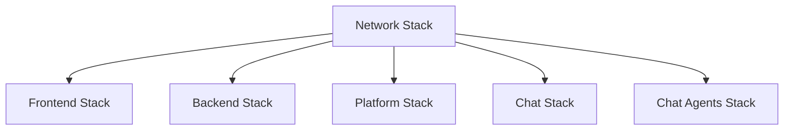

# Trya Infrastructure

Repositório centralizado para provisionamento de infraestrutura AWS do projeto Trya.

## Estrutura do Repositório

```
handslab-trya-infra/
├── environments/           # Configurações por ambiente
│   ├── dev/               # Ambiente de desenvolvimento
│   │   ├── *.backend.conf # Backend configs por stack
│   │   └── *.tfvars       # Variables por stack
│   └── hml/               # Ambiente de homologação
│       ├── *.backend.conf
│       └── *.tfvars
├── modules/               # Módulos Terraform reutilizáveis
│   ├── acm/              # Certificados ACM
│   ├── aurora/           # Aurora PostgreSQL
│   ├── cloudfront/       # CloudFront distributions
│   ├── dynamodb/         # DynamoDB tables
│   ├── ecr/              # ECR repositories
│   ├── ecs_service/      # ECS services + ALB
│   ├── elasticache/      # ElastiCache (Serverless/tradicional)
│   ├── lambda/           # Lambda functions
│   ├── network/          # VPC, subnets, NAT, IGW
│   ├── observability/    # CloudWatch dashboards/alarms
│   ├── rds_postgres/     # RDS PostgreSQL
│   ├── route53/          # Route53 zones
│   ├── s3_static_site/   # S3 buckets
│   ├── secrets/          # Secrets Manager
│   ├── vpc-endpoints/    # VPC endpoints
│   └── waf/              # WAF Web ACL
├── stacks/               # Stacks por serviço
│   ├── network/          # VPC, subnets, gateways
│   ├── frontend/         # Frontend (Next.js em ECS)
│   ├── backend/          # Backend API (NestJS em ECS)
│   ├── platform/         # Platform backend
│   ├── chat/             # Chat backend
│   └── chat-agents/      # Chat agents (Lambda + DynamoDB)
├── scripts/              # Scripts auxiliares
│   └── import-dev.sh     # Script de import para DEV
├── deploy-stack.sh       # Script de deploy por stack
└── IMPORT_GUIDE.md       # Guia de import de recursos
```

## Ambientes

| Ambiente | Domínios                                          |
|----------|---------------------------------------------------|
| DEV      | `dev.trya.com.br`, `api-dev.trya.com.br`, etc.   |
| HML      | `hml.trya.com.br`, `api-hml.trya.com.br`, etc.   |
| PROD     | `trya.com.br`, `api.trya.com.br`, etc.           |

## Pré-requisitos

1. **Terraform** >= 1.5.0
2. **AWS CLI** configurado com profile `skopia`
3. Acesso à conta AWS (ID: 416684166863)

## Como usar

### Deploy de um stack específico

```bash
# Sintaxe: ./deploy-stack.sh <ambiente> <stack> <ação>

# Plan do network stack em DEV
./deploy-stack.sh dev network plan

# Apply do frontend stack em HML
./deploy-stack.sh hml frontend apply

# Destroy do backend stack em DEV
./deploy-stack.sh dev backend destroy
```

### Deploy manual

```bash
# Entrar no diretório do stack
cd stacks/network

# Inicializar com o backend correto
terraform init -backend-config=../../environments/dev/network.backend.conf

# Plan
terraform plan -var-file=../../environments/dev/network.tfvars

# Apply
terraform apply -var-file=../../environments/dev/network.tfvars
```

## Stacks e Dependências



### Ordem de deploy

1. **Network** (primeiro - todas as outras dependem)
2. **Backend** (RDS + ECS + ALB)
3. **Frontend** (ECS + ALB)
4. **Platform** (ECS + ALB + S3)
5. **Chat** (ECS + ALB)
6. **Chat-Agents** (Lambda + DynamoDB + ElastiCache)

## Migração de recursos existentes

Para importar recursos AWS existentes para o Terraform, consulte o [IMPORT_GUIDE.md](IMPORT_GUIDE.md).

## State Management

- **Bucket S3**: `trya-terraform-state`
- **DynamoDB Lock**: `trya-terraform-locks`
- **Região**: `sa-east-1`

Cada stack tem seu próprio state file:
- `dev/network/terraform.tfstate`
- `dev/frontend/terraform.tfstate`
- `dev/backend/terraform.tfstate`
- etc.

## Recursos por Stack

### Network Stack
- VPC
- Subnets (públicas e privadas)
- Internet Gateway
- NAT Gateway
- Route Tables

### Frontend Stack
- ECR Repository
- ECS Cluster + Service
- ALB + Target Group
- Route53 Record (`{env}.trya.com.br`)

### Backend Stack
- ECR Repository
- ECS Cluster + Service
- ALB + Target Group
- RDS PostgreSQL
- Secrets Manager
- Route53 Record (`api-{env}.trya.com.br`)

### Platform Stack
- ECR Repository
- ECS Cluster + Service
- ALB + Target Group
- S3 Bucket (assets)
- Route53 Record (`platform-{env}.trya.com.br`)

### Chat Stack
- ECR Repository
- ECS Cluster + Service
- ALB + Target Group
- Route53 Record (`chat-{env}.trya.com.br`)

### Chat-Agents Stack
- Lambda Function (Python, VPC)
- DynamoDB Table (sessions)
- S3 Bucket (transcription/images)
- ElastiCache Serverless (Valkey)
- VPC Endpoints (Bedrock, Transcribe, etc.)

## Troubleshooting

### Erro de credenciais
Certifique-se de que o profile `skopia` está configurado:
```bash
aws configure --profile skopia
aws sts get-caller-identity --profile skopia
```

### State lock
Se o state estiver travado:
```bash
terraform force-unlock <LOCK_ID>
```

### Recurso já existe
Use `terraform import` para adotar o recurso existente. Consulte IMPORT_GUIDE.md.
